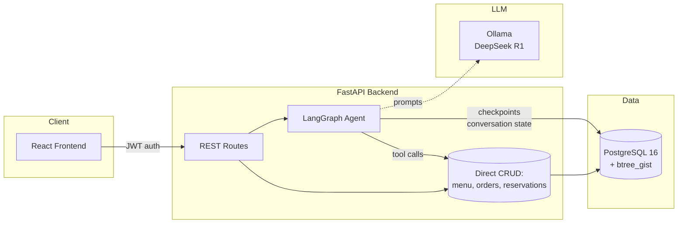
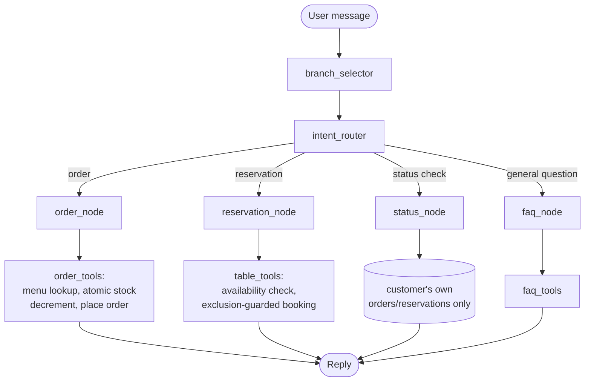

# Architecture — Multi-Branch Restaurant AI Agent

This document covers the technical decisions behind GourmetBistro AI: how the conversational agent is structured, how data integrity is guaranteed despite an LLM being in the request path, and a log of real bugs found and fixed during development — included deliberately, because the debugging process is as representative of the engineering here as the final code.

## System overview



Two paths into the database: the admin dashboard talks to the database directly through ordinary REST CRUD routes (no LLM involved — staff actions should be deterministic and fast). The customer chat path goes through the LangGraph agent, which calls the *same* underlying tools/DB operations as the CRUD routes, rather than duplicating logic. The LLM never touches the database directly — it can only trigger a fixed set of tool functions, each of which enforces its own validation regardless of what the model asked for.

## The agent: router + specialized sub-agents



**Why a router instead of one LLM call with every tool bound at once:** with ordering, reservations, status lookups, and FAQ all as one tool list, a small model conflates contexts — it starts trying to "check availability" mid-order, or hallucinates a menu item while discussing table capacity. Splitting into a cheap classification step plus small, single-purpose sub-agents keeps each domain's prompt focused and makes each one independently testable.

**Why `status_node` is scoped the way it is:** it never accepts an order/reservation ID sourced from the LLM or the chat payload. `customer_id` is injected into agent state from the authenticated JWT dependency at the route level, before the agent ever runs — so a customer cannot look up another customer's order by guessing or asking the agent to fetch an arbitrary ID. The trust boundary is the auth layer, not the model's judgment.

**Handling a small, less reliable model:** DeepSeek R1 (run locally via Ollama, chosen for zero cost) emits `<think>...</think>` reasoning traces before its actual output and is meaningfully less reliable at structured tool-calling than a hosted frontier model. `agent/llm.py` includes a defensive parser that strips reasoning traces (including unclosed ones, if the model runs out of tokens mid-thought), and attempts to extract/repair JSON from the response before falling back to a rule-based reply if parsing still fails. This is a direct, deliberate trade-off of the zero-cost constraint: reliability work that a hosted model would make unnecessary.

## Data integrity: pushed to PostgreSQL, not trusted to application code

Two invariants in this system cannot be violated even under concurrent requests or an LLM making a bad call, because they're enforced by the database engine itself:

**No double-booked tables.** Reservations store a `TSTZRANGE` (`booking_window`) and the table carries a PostgreSQL exclusion constraint:
```sql
EXCLUDE USING gist (
    table_id WITH =,
    booking_window WITH &&
) WHERE (status = 'confirmed')
```
Two confirmed reservations for the same table with overlapping time ranges cannot both exist — the second `INSERT` fails at the database level with an `IntegrityError`, which the reservation tool catches and turns into a graceful "that table was just taken, here are alternatives" response. This guarantee holds regardless of application-level race conditions, retries, or bugs in the agent's reasoning.

**No overselling stock.** Order placement uses an atomic conditional update rather than a check-then-write:
```sql
UPDATE menu_item_stocks
SET stock_quantity = stock_quantity - :qty
WHERE menu_item_id = :item_id AND branch_id = :branch_id
  AND stock_quantity >= :qty
```
If two customers simultaneously order the last unit of an item, exactly one `UPDATE` affects a row (`rowcount == 1`); the other affects zero rows and is rejected. This is enforced by PostgreSQL's row-level locking during the update, not by a separate `SELECT` followed by an `UPDATE` in application code, which would have a race window between the two statements.

The same "reverse the decrement" logic applies on order cancellation, and — a case that's easy to miss — the *reverse* direction on un-cancel: re-decrementing stock, using the same atomic conditional pattern, and rejecting the un-cancel with a `409 Conflict` if that stock has since been sold to someone else. All of it — status change plus stock adjustment — commits as one transaction.

## Auth

Two separate JWT-based auth flows — customer and staff — rather than one role field on a shared user table, since the two have almost no overlapping permissions or data access and conflating them would make it easy to accidentally leak a staff-only field into a customer-facing response (or vice versa).

## Engineering log: real issues found and fixed

Included because working through these is a more honest signal of engineering ability than a bug-free changelog would be.

| Issue | Root cause | Fix |
|---|---|---|
| Chat endpoint timed out on **every** message after ~30s | `chat.py` constructed a brand-new `psycopg_pool.AsyncConnectionPool` per request instead of reusing one; a fresh pool has no live connections yet, so checking one out immediately hit the pool's default 30s checkout timeout | Pool created once in FastAPI's `lifespan` startup, stored on `app.state`, reused across all requests |
| Sign-in appeared to silently fail (navbar never updated) | Backend returned the authenticated user under the JSON key `user`; frontend read `res.customer` — a key that never existed in the response | Traced by reading both sides of the contract rather than assuming the bug was in either one alone; corrected the frontend's field access |
| Page-wide horizontal scrollbar | Flex containers (navbar, chat layout) had no `min-width: 0`, so children refused to shrink below their intrinsic width, pushing overflow all the way up to `<html>` | Confirmed root cause with a one-line browser console scan (`scrollWidth` vs `clientWidth` across the DOM) before writing a fix, rather than guessing |
| Cancelling an order didn't restore stock | Status-update endpoint changed the `status` field but never touched `menu_item_stocks` on any transition | Added stock restoration on cancel *and* re-validation on un-cancel (rejecting it with `409` if that stock was resold in the meantime) |
| Seed script crashed on second run | `SELECT` with no `LIMIT` fetched all rows; `.scalar_one_or_none()` requires 0 or 1 and raised `MultipleResultsFound` once 2+ branches existed — meaning the "already seeded, skip" guard broke *because* seeding had already succeeded | Added `.limit(1)` |
| A `500` on account creation and a stuck menu load looked like two bugs | Both were the same root cause — the backend process wasn't running/reachable, so every request failed the same way | Diagnosed by checking the backend terminal directly rather than treating the two symptoms as independent |

## Known trade-offs

- **`CORS allow_origins=["*"]` combined with `allow_credentials=True`** is permissive by design for local chat-widget embedding during development; this should be narrowed to explicit origins before any public deployment.
- **Seeded credentials are demo values** (`admin123`, etc.) with no forced rotation — acceptable for local development, not for a public URL.
- **Test suite currently exercises the live local LLM** in some paths rather than mocking `OllamaDeepSeekClient.generate()`, making those tests slower and dependent on Ollama being installed and running wherever the suite executes.
